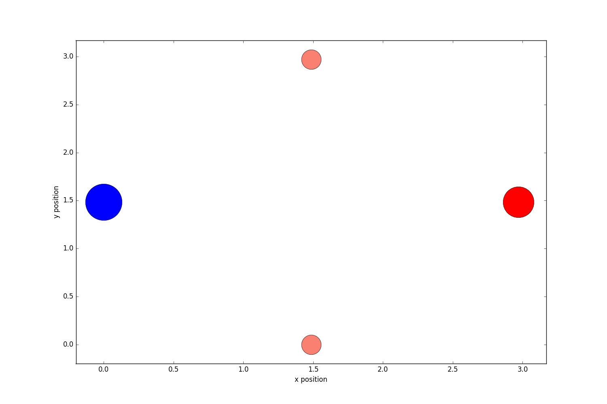
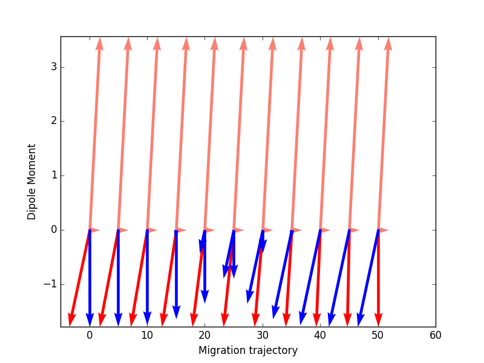
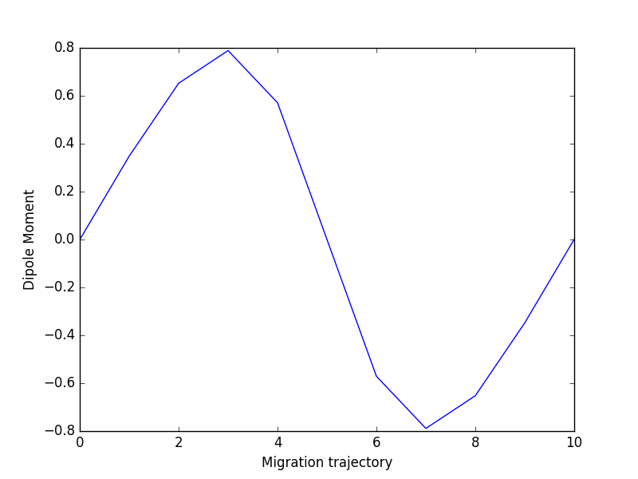

# Dipole Moment of Migrating Charges

Dipole moment of a migrating system of classical charges. Set up a system of particles' initial and final positions. Then calculate the system's dipole moment change. The code contains a classical simulation of a defect's (vacancy) migration with (Mulliken) charges obtained from DFT simulations of MgO.

## Positions of the particles
Mg:       Salmon pink
O:        Red
Vacancy:  Blue

## Individual Atom Contributions to Dipole Moments Along Trajectorys
Same colour scheme as above

## Dipole Moment Magnitude Along Trajectorys

